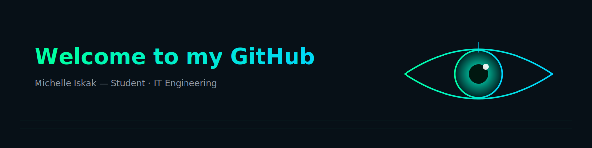

  

# 💫 About Me:
👋 Hey — I'm Michelle Iskak  🔒 Student · IT Engineering  --- About Me - 🎓 I'm a student focused on technology and engineer.   - 💻 I enjoy building software, researching vulnerabilities, and applying defensive measures after testing.   - 🌱 Currently learning engineer with emphasis on Programming Language.   - 🧩 Open to collaboration and mentorship on fullstack developer, network security, secure coding, and system hardening.   - ⚡ Fun fact: I once spent hours debugging only to find a missing semicolon.  
 -- Connect with me - Instagram: https://www.instagram.com/leand.mi/ - LinkedIn: https://www.linkedin.com/in/michelle-iskak/ - GitHub: https://github.com/limmi26   - Email: info.michh@gmail.com   

## 🌐 Socials:
  

  

## 💻 Language  

  
  

  

# 💻 Tech Stack:

  
  
  
  
  
  

# 📊 GitHub Stats:
 
 

## 🏆 GitHub Trophies

### ✍️ Random Dev Quote

  <svg width="700" height="100" xmlns="http://www.w3.org/2000/svg">
    <!-- Background -->
    <rect width="700" height="100" rx="12" ry="12" fill="#071430"/>
    <!-- Quote Text -->
    <text x="50%" y="50%" dominant-baseline="middle" text-anchor="middle" font-size="24" fill="#00E5FF" font-family="monospace">
      "There is no lock in this world that cannot be opened."
    </text>
  </svg>

---

<!-- Proudly created with GPRM ( https://gprm.itsvg.in ) -->

  

